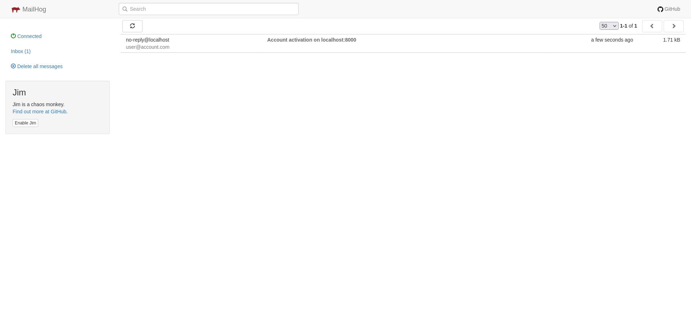

# {{ cookiecutter.project_name }}

{{ cookiecutter.project_description }}

## Project Requirements

### Development Requirements
* [Docker](https://docs.docker.com/get-started/overview/) and [Docker Compose](https://docs.docker.com/compose/) for an easy to use and reproducible development environment.

### Deployment Requirements

* [Terraform](https://www.terraform.io/) for managing infrastructure and provisioning it.
* [AWS Cli](https://aws.amazon.com/cli/) for storing your AWS credentials for terraform to use.

## Quickstart

Start the dev server for local development:
```bash
docker-compose up
```
You can access your local environment at [http://localhost:8000](http://localhost:8000)

Enter the docker container (while the server is running), migrate, and create a user for yourself:
```bash
# Enters a shell in the docker container
docker-compose exec web bash

# And create a superuser for yourself.
# You'll be prompted to enter a first name, last name, email, password, and password confirmation
$ ./manage.py createsuperuser
```
After creating the superuser you can access the admin panel at [http://localhost:8000/admin/](http://localhost:8000/admin/)

Optionally run the tests from within the docker container at anytime:
```bash
# From within docker container
$ pytest
```

> Make sure you store the credentials files `staging.tfvars` and `prod.tfvars` in a secure location (as it is not committed to the repository). Internally we use [Zoho Vault](https://www.zoho.com/vault) for secure credential storage.

## The Batteries

The starter project is **Batteries Included**, meaning it comes with lots of helpful feature preinstalled for you, to make your life as a developer easier. What follows is a list of what we include and where to find more information about them.

* [Django](https://www.djangoproject.com/) is the framework that we are building on top of. If you are unfamiliar with django, it has a great [tutorial](https://www.djangoproject.com/start/) to get you introduced to the basic concepts.
* [Django REST Framework](https://www.django-rest-framework.org/) (also known as DRF) specializes django to excel in serving a great API. It provides, serialization, authentication, and a browseable API that you can use in development to aid your API development experience.
* [djoser](https://djoser.readthedocs.io/en/latest/introduction.html) provides a set of Django REST Framework endpoints that give us token authentication, registration, invitation, activation, forgot password, and other handy API endpoints for free.
* [django-filter](https://django-filter.readthedocs.io/) integrated with DRF which provides us powerful filtering capabilities that our API endpoints can take advantage of.
* [easy_thumbnails](https://github.com/SmileyChris/easy-thumbnails) which can automatically thumbnail user uploaded image files for optimized display on the frontend.
* [djangorestframework-camel-case](https://github.com/vbabiy/djangorestframework-camel-case) ensure that the REST api we provide uses camelcase, even though it's django conventions to use snake case. This package allows us to use snake case in django and still interact with camel case (which is standard on the frontend)
* [Django Debug Toolbar](https://django-debug-toolbar.readthedocs.io/en/latest/) which can be used in conjunction with the DRF Browsable API to get a deeper look at what SQL queries certain API endpoints are running, along with other helpful information in development.
* [Mailhog](https://github.com/mailhog/MailHog) for viewing emails "sent" in development while not actually sending emails while developing the software.
* [CircleCI Config](https://circleci.com/) for automatic testing and deployments to both staging and production

## Development Process

What follows is a short summary of what the day to day will look like working in this starter project. For more detailed information on the main components, the [Django documentation](https://docs.djangoproject.com/en/4.0/) and [Django REST Framework](https://www.django-rest-framework.org/) documentation will be a source of more in depth answers to questions.

### The Django REST Framework Browsable API

Django REST Framework provides a great browsable API that lets you easily utilize your API without a frontend, and without using something like Postman. You can authenticate with it to log in, and browse the API making any kind of API request your API allows.


The debug toolbar also integrates well with this browsable API. The most useful functions of the debug tools are being able to see SQL queries that request made, the raw request information.


You can view mail sent by the server at http://localhost:8025/ which
displays a MailHog page with various functionality.



For more information about Django REST Framework, see the [DRF docs](https://www.django-rest-framework.org/)

### Models

A model is the single, definitive source of information about your data. Your models define what the structure of your database looks like. A typical model looks something like this:

```python
class MyCoolModel(TimeStampedModel, models.Model):
    name = models.CharField(max_length=255)
    email = models.EmailField(unique=True)
    phone_number = PhoneNumberField()
    address = models.OneToOneField(Address, on_delete=models.CASCADE, null=True, blank=True)
```

After you make changes to your models you need to tell Django to update your database to match your models.

For more details on Django models, see [the Django model docs](https://docs.djangoproject.com/en/4.0/topics/db/models/)

### Migrations

Django autogenerates migrations for you to match your database schema to what you have defined in your model files. The important commands are:

```bash
# From within your docker container

$ ./manage.py makemigrations # generate a migration based on your models
$ ./manage.py migrate # applies any un-applied migrations
```

For more details on how Django handles migrations, see [the Django migration docs](https://docs.djangoproject.com/en/4.0/topics/migrations/)
